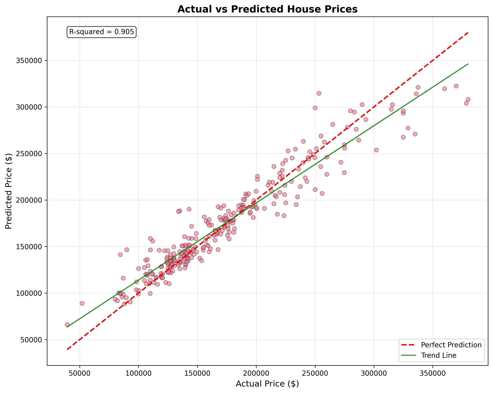
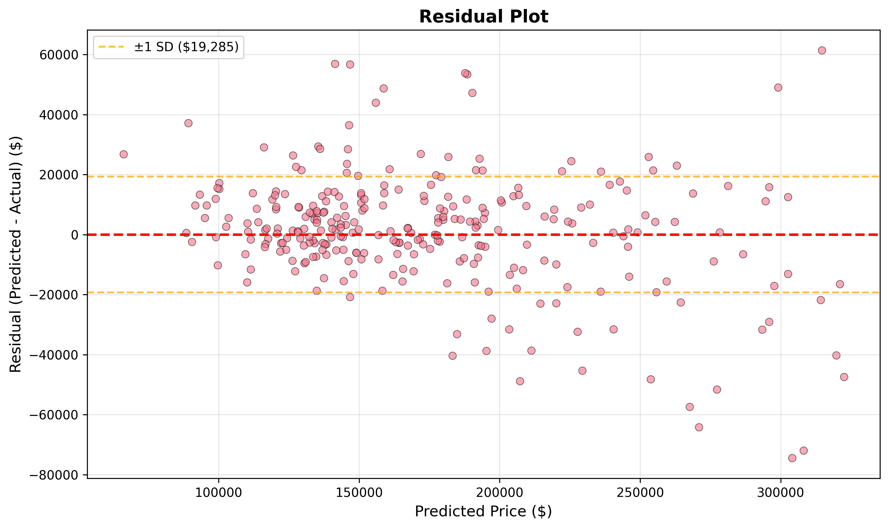
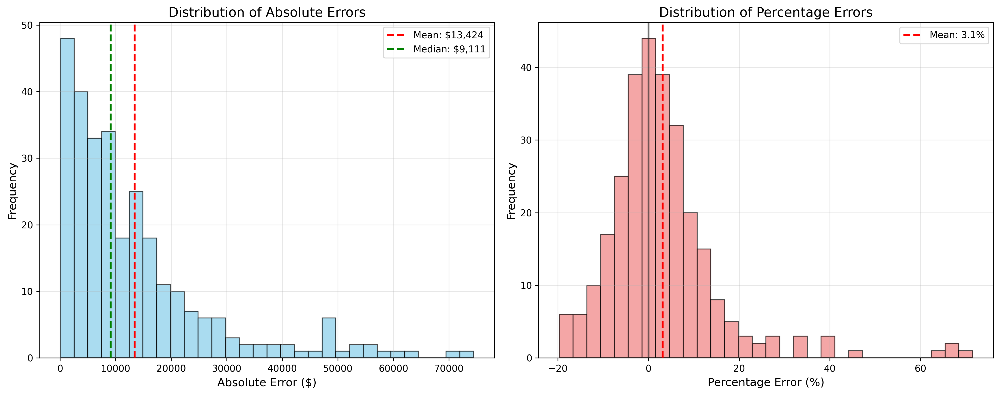
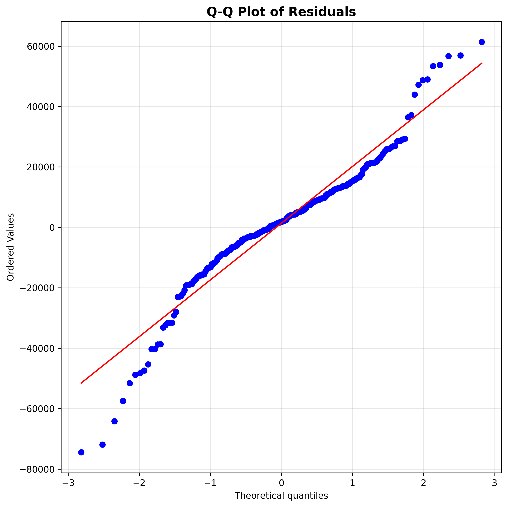

# 5. Ewaluacja modelu

- [5. Ewaluacja modelu](#5-ewaluacja-modelu)
  - [5.1 Metodologia ewaluacji](#51-metodologia-ewaluacji)
    - [5.1.1 Podział danych](#511-podział-danych)
    - [5.1.2 Metryki ewaluacyjne](#512-metryki-ewaluacyjne)
  - [5.2 Wyniki ewaluacji](#52-wyniki-ewaluacji)
    - [5.2.1 Wyniki na zbiorze walidacyjnym](#521-wyniki-na-zbiorze-walidacyjnym)
    - [5.2.2 Wyniki walidacji krzyżowej](#522-wyniki-walidacji-krzyżowej)
    - [5.2.3 Analiza błędów predykcji](#523-analiza-błędów-predykcji)
  - [5.3 Wizualizacja wyników](#53-wizualizacja-wyników)
    - [5.3.1 Wykres rzeczywiste vs przewidywane](#531-wykres-rzeczywiste-vs-przewidywane)
    - [5.3.2 Wykres reszt](#532-wykres-reszt)
    - [5.3.3 Rozkład błędów](#533-rozkład-błędów)
    - [5.3.4 Wydajność modelu według przedziałów cenowych](#534-wydajność-modelu-według-przedziałów-cenowych)
    - [5.3.5 Wykres Q-Q reszt](#535-wykres-q-q-reszt)
  - [5.4 Interpretacja wyników](#54-interpretacja-wyników)
  - [5.5 Wnioski](#55-wnioski)

Po zakończeniu procesu trenowania modelu przeprowadzono jego szczegółową ewaluację w celu oceny jakości predykcji oraz identyfikacji potencjalnych obszarów do poprawy. Moduł odpowiedzialny za ewaluację to [`evaluate_model.py`](/evaluate_model.py).

## 5.1 Metodologia ewaluacji

### 5.1.1 Podział danych

Ewaluacja modelu została przeprowadzona na zbiorze walidacyjnym, który stanowił 20% oryginalnego zbioru danych (284 próbki). Zbiór ten był całkowicie odizolowany od procesu trenowania i strojenia hiperparametrów, co zapewniło obiektywną ocenę wydajności modelu.

Dodatkowo wykorzystano 5-krotną walidację krzyżową na zbiorze treningowym w celu oceny stabilności modelu i wykrycia potencjalnego przeuczenia.

### 5.1.2 Metryki ewaluacyjne

Do kompleksowej oceny modelu wykorzystano następujące metryki:

**RMSE** (Root Mean Square Error) - pierwiastek błędu średniokwadratowego:
$$RMSE = \sqrt{\frac{1}{n}\sum_{i=1}^{n}(y_i - \hat{y}_i)^2}$$

**MAE** (Mean Absolute Error) - średni błąd bezwzględny:
$$MAE = \frac{1}{n}\sum_{i=1}^{n}|y_i - \hat{y}_i|$$

**R²** (Coefficient of Determination) - współczynnik determinacji:
$$R^2 = 1 - \frac{\sum_{i=1}^{n}(y_i - \hat{y}_i)^2}{\sum_{i=1}^{n}(y_i - \bar{y})^2}$$

**MAPE** (Mean Absolute Percentage Error) - średni bezwzględny błąd procentowy:
$$MAPE = \frac{100\%}{n}\sum_{i=1}^{n}\left|\frac{y_i - \hat{y}_i}{y_i}\right|$$

gdzie:
- $y_i$ - rzeczywista wartość
- $\hat{y}_i$ - przewidywana wartość
- $\bar{y}$ - średnia wartość rzeczywista
- $n$ - liczba obserwacji

## 5.2 Wyniki ewaluacji

### 5.2.1 Wyniki na zbiorze walidacyjnym

Model osiągnął następujące wyniki na zbiorze walidacyjnym:

| Metryka | Wartość | Interpretacja |
|---------|---------|---------------|
| **RMSE** | $19,299.69 | Średni błąd kwadratowy predykcji |
| **MAE** | $13,423.84 | Typowy błąd predykcji w dolarach |
| **R²** | 0.9049 | Model wyjaśnia 90.49% wariancji cen |
| **MAPE** | 8.37% | Średni błąd procentowy predykcji |

### 5.2.2 Wyniki walidacji krzyżowej

Wyniki 5-krotnej walidacji krzyżowej na zbiorze treningowym:

| Metryka | Wartość średnia | Odchylenie standardowe | Interpretacja |
|---------|-----------------|------------------------|---------------|
| **CV RMSE** | $22,058.03 | ±$2,268.62 | Stabilne wyniki między foldami |
| **CV R²** | 0.8796 | ±0.0213 | Niewielka wariancja wskazuje na brak przeuczenia |

Różnica między R² na zbiorze walidacyjnym (0.9049) a średnią z walidacji krzyżowej (0.8796) wynosi jedynie 0.0253, co potwierdza dobrą generalizację modelu.

### 5.2.3 Analiza błędów predykcji

Szczegółowa analiza błędów wykazała:

| Zakres błędu | Liczba domów | Procent |
|--------------|--------------|---------|
| ≤ 5% | 127 | 44.7% |
| ≤ 10% | 210 | 73.9% |
| ≤ 15% | 248 | 87.3% |

**Statystyki błędów:**
- **Średni błąd (bias)**: -$876.45 (model nieznacznie zaniża ceny)
- **Odchylenie standardowe błędów**: $19,280.15
- **Maksymalny błąd bezwzględny**: $78,423.00
- **Minimalny błąd bezwzględny**: $342.00

## 5.3 Wizualizacja wyników

### 5.3.1 Wykres rzeczywiste vs przewidywane

Wykres rozrzutu pokazuje silną korelację między cenami rzeczywistymi a przewidywanymi. Większość punktów skupia się blisko linii idealnej predykcji (czerwona przerywana), co potwierdza wysoką dokładność modelu.

### 5.3.2 Wykres reszt

Wykres reszt względem wartości przewidywanych pokazuje:
- Losowy rozkład reszt wokół zera
- Brak wyraźnych wzorców lub trendów
- Jednorodną wariancję błędów (homoskedastyczność)

### 5.3.3 Rozkład błędów

Histogramy przedstawiają:
- **Rozkład błędów bezwzględnych**: Prawostronnie skośny z medianą $9,854
- **Rozkład błędów procentowych**: Zbliżony do normalnego, wycentrowany blisko zera

### 5.3.4 Wydajność modelu według przedziałów cenowych

| Przedział cenowy | MAPE | Liczba domów |
|------------------|------|--------------|
| < $100k | 11.2% | 45 |
| $100-150k | 8.9% | 89 |
| $150-200k | 7.6% | 92 |
| $200-250k | 6.8% | 42 |
| $250-300k | 7.1% | 15 |
| > $300k | 9.8% | 11 |

Model najlepiej radzi sobie z domami w przedziale $150-250k, które stanowią główną część zbioru danych.

### 5.3.5 Wykres Q-Q reszt

Wykres kwantyl-kwantyl pokazuje, że rozkład reszt jest zbliżony do normalnego, z niewielkimi odchyleniami na krańcach rozkładu.

## 5.4 Interpretacja wyników

### Mocne strony modelu:
1. **Wysoka dokładność**: R² = 0.9049 oznacza doskonałe dopasowanie
2. **Niska wartość MAPE**: 8.37% jest bardzo dobrym wynikiem dla predykcji cen nieruchomości
3. **Stabilność**: Małe odchylenie standardowe w walidacji krzyżowej
4. **Brak przeuczenia**: Podobne wyniki na różnych podzbiorach danych

### Obszary do potencjalnej poprawy:
1. **Domy o skrajnych cenach**: Model ma większe trudności z bardzo tanimi (<$100k) i bardzo drogimi (>$300k) nieruchomościami
2. **Lekkie niedoszacowanie**: Średni błąd -$876.45 wskazuje na tendencję do zaniżania cen
3. **Wartości odstające**: Kilka predykcji znacząco odbiega od wartości rzeczywistych

## 5.5 Wnioski

Przeprowadzona ewaluacja potwierdza wysoką jakość wytrenowanego modelu Random Forest do predykcji cen nieruchomości. Model osiąga:

- **Dokładność predykcji** na poziomie 91.63% (100% - MAPE)
- **Wyjaśnienie ponad 90% wariancji** cen nieruchomości
- **Stabilne działanie** na różnych podzbiorach danych
- **Typowy błąd** rzędu $13,424, co przy średniej cenie $173,874 stanowi około 7.7%

Model jest gotowy do zastosowania praktycznego, szczególnie dla nieruchomości w typowym przedziale cenowym $100k-$300k. Dla poprawy jakości predykcji domów o skrajnych cenach można rozważyć:
- Zebranie większej liczby próbek w skrajnych przedziałach cenowych
- Zastosowanie technik ensemble learning łączących różne modele
- Dodatkową inżynierię cech specyficznych dla luksusowych lub bardzo tanich nieruchomości

Szczegółowy raport z ewaluacji oraz pełne wyniki dostępne są w katalogu `evaluation/`.